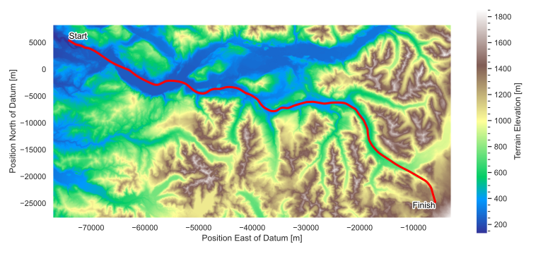
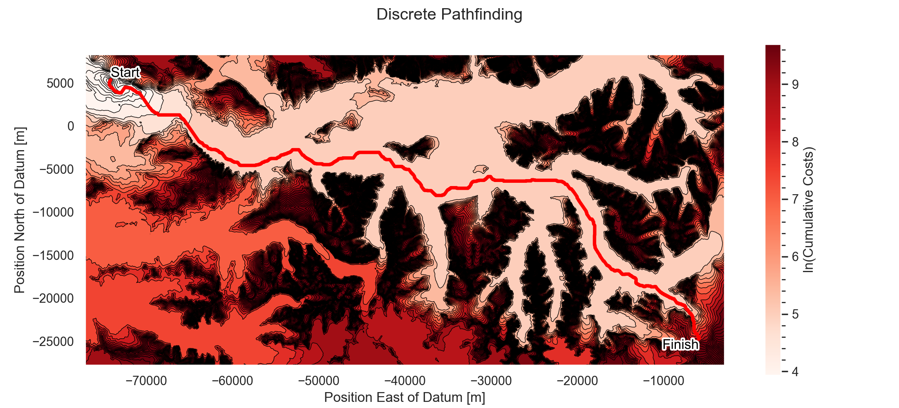
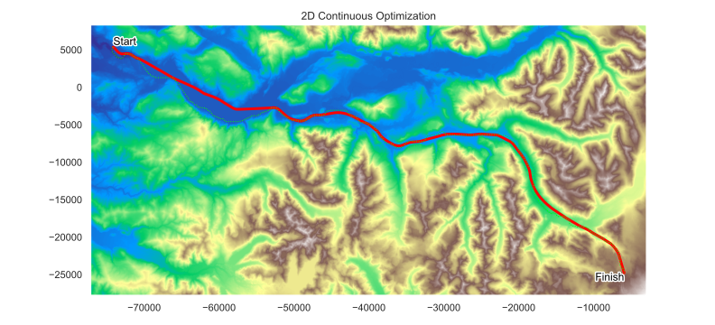

# Air Racing Optimization

Peter Sharpe

-----

This is an aircraft trajectory optimization case study focusing on fast, low-altitude flight through mountainous terrain. Ultimately, this nap-of-the-earth flight is often used for evading radar detection while reaching an objective.

<iframe width="560" height="315" src="https://www.youtube.com/embed/_HpraPLS6G4?si=bYJqMxd2883x5RL2" title="YouTube video player" frameborder="0" allow="accelerometer; autoplay; clipboard-write; encrypted-media; gyroscope; picture-in-picture; web-share" allowfullscreen></iframe>

The task is to fly a fighter jet (loosely modeled after an F/A-18) between two points near Riffe Lake, Washington, USA.

The objective function incentivises:
* Flying as low as possible
* Flying as fast as possible
* A (slight) regularization penalty for aggressive control inputs, to incentive smoother, more realistic control strategies.

This task is identical to one of the "Top Gun Maverick" low-altitude flight challenges included in Microsoft Flight Simulator. 

(The objective function / scoring function has been tweaked slightly from the original Microsoft Flight Simulator one to make it more mathematically well-posed.)

## Process

A motion planning / trajectory design problem for low-altitude flight through mountainous terrain is inherently non-convex, and hence, difficult to optimize. This is because many discrete "pathing" decisions need to be made. For example: should we fly to the left or to the right of an obstacle?

Since most gradient-based optimizers are local optimizers, we want some kind of process (or perhaps, a heuristic) to do some kind of global path planning search.

In this case study, this is done through a series of sequential optimization steps.

### Step 0: Terrain Data

Terrain data around Riffe Lake is obtained from the USGS dataset, at 1-arcsecond resolution (roughly 20 x 30 meter resolution). The data is on a regular 2D grid.

### Step 1: Pathfinding

In the first step, shown in `pathfinding.py` in this repository, we execute a discrete pathfinding algorithm using dynamic programming. This is purely 2D and a function of only the terrain data. This is basically graph traversal, but the fact that the graph corresponds to a 2D grid allows some shortcuts. Allowable "moves" within the grid are immediate neighbors (including diagonals).

To execute this algorithm, we first build up a heuristic for the "traversal cost" of every point in the terrain. This traversal cost is always positive and a function of elevation; the more elevation is weighted in this function, the more the pathfinding algorithm will prioritize low-altitude flight over fast flight.

This heuristic is a difference-of-Gaussians (seen in `get_task_info.py`), which gives a high-pass-filtered version of the terrain data. It is then normalized by the mean and standard deviation of this result; with a scalar used to control the impact of elevation on traversal cost. It is then wrapped with `exp()` to make it always positive.

The resulting traversal cost is then the path integral of this heuristic (using trapezoidal integration) along this path.

Based on this, we get the following optimal result. Below, the colors correspond to the cumulative cost of the trajectory beginning at the start and ending at any given point in the terrain. (In reality, this algorithm is truncated early once the dynamic programming algorithm reaches the target end point.)

Notice how each discrete move on the trajectory is either horizontal, vertical, or diagonal (allowable steps in our graph traversal problem formulation).

This search is guaranteed to be globally optimal (albeit, it is a relaxation of the true problem, as it includes no dynamics constraints). This makes it a good initial guess for the following steps.

## Step 2: 2D Optimization

Following the discrete pathfinding problem, we perform a 2D optimization study that relaxes the discrete-terrain model of the pathfinding algorithm. In other words, we go from a graph traversal algorithm (the world of dynamic programming, Djikstra / A*, etc.) to the world of trajectory optimization (e.g., direct collocation).

This allows us to formulate the actual (continuous) objective function that we are interested in, which is roughly to minimize the following unitless quantity:

(duration / (240 seconds))^4 + 15 * mean(terrain_altitude / (440 meters))

A slight regularization penalty is added on the squared second derivative of any control inputs (in the 2D case, the input is essentially just the bearing angle as a function of time).

The figure below shows the 2D path (red) compared to to the discrete path from the previous step (dashed light green).

## Step 3: 3D Optimization

The result of this 2D optimization is then fed in as an initial guess for a 3D optimization problem with full dynamics constraints. This is done using direct collocation, with a 3rd-order cubic spline integrator.

This yields the following final trajectory:

